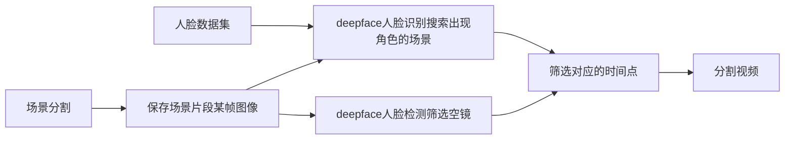

# EpisodeClipper

一个自动化砍柴脚本解放剪刀手，可对多个视频进行场景分割、截取视频中多个指定角色片段和空镜，项目基于Python3.7 64-bit

## 如何使用

### 1. 安装ffmpeg

<https://ffmpeg.org/download.html>下载，解压文件，将文件夹下的`bin`文件夹路径添加进环境变量

### 2. 安装依赖

`pip install -r requirements.txt`

### 3. 安装模型

以下两种方法任选其一。

- 直接运行程序，模型自动下载
- <https://github.com/serengil/deepface_models/releases>下载`facenet512_weights.h5`和`retinaface.h5`，放入`.deepface/weights`文件夹

### 4. 准备数据

```
input
├─role1
│      1.jpg
│      2.jpg
│      3.jpg
│      4.jpg
│
├─role2
│      1.jpg
│      2.jpg
│      3.jpg
│      4.jpg
│      5.jpg
│      6.jpg
│
└─role3
        1.jpg
        2.jpg
        3.jpg
        4.jpg
        5.jpg

video
  1.mp4
  2.mkv
```

- `input`: 为每个角色新建文件夹（如role1、role2），每个角色对应文件夹下存放 2 张以上（建议10张左右）单人人脸图像（建议使用同部剧集视频截图），**文件夹和图像名称不要有中文字符**
- `video`: 手动新建此文件夹并存放MP4/MKV/FLV格式待剪辑视频，**建议视频名称不要有中文字符，否则视频会被重命名，中文字符替换为拼音**

## 函数调用示例

```python
clip = EpClipper(start_time='00:15:00', end_time='00:30:00', modes=[0, 1, 2])
clip.clip_episodes()
```

- **参数说明**
  
  - `start_time`: 剪辑开始时间，默认视频开端，格式`hh:mm:ss`，可用于跳过片头曲
  - `end_time`: 剪辑结束时间，默认视频结尾，格式`hh:mm:ss`，可用于跳过片尾曲
  - `mode`: 指定剪辑模式，0-分割场景/1-角色场景/2-空镜，默认模式0（分割场景），模式可组合使用，如`modes=[0, 1]`即分割所有场景和角色场景

- **输出**
  
```
B-roll
└─1
    │  1-Scene001.mp4
    │  1-Scene002.mp4
    │  1-Scene003.mp4
    │  scene_list.csv
    │
    └─scene
            1-Scene-001-01.jpg
            1-Scene-002-01.jpg
            1-Scene-003-01.jpg
```
  - B-roll视频片段：`B-roll/视频名称/[...].mp4`
  - 片段对应场景截图：`B-roll/视频名称/scene/[...].jpg`
  - 片段对应时间节点文件：`B-roll/视频名称/scene_list.csv`
```
role
├─role1
│  └─1
│      │  1-Scene001.mp4
│      │  1-Scene002.mp4
│      │  1-Scene003.mp4
│      │  scene_list.csv
│      │
│      └─scene
│              1-Scene-001-01.jpg
│              1-Scene-002-01.jpg
│              1-Scene-003-01.jpg
│
├─role2
│  └─1
│      │  1-Scene001.mp4
│      │  1-Scene002.mp4
│      │  1-Scene003.mp4
│      │  scene_list.csv
│      │
│      └─scene
│              1-Scene-001-01.jpg
│              1-Scene-002-01.jpg
│              1-Scene-003-01.jpg
│
└─role3
```
  - 角色视频片段：`role/角色/视频名称/[...].mp4`
  - 片段对应场景截图：`role/角色/视频名称/scene/[...].jpg`
  - 片段对应时间节点文件：`role/角色/视频名称/scene_list.csv`

```
clip
├─1
│  │  1-Scene001.mp4
│  │  1-Scene002.mp4
│  │  1-Scene003.mp4
│  │  1-Scene004.mp4
│  │  scene_list.csv
│  │
│  └─scene
│          1-Scene-001-01.jpg
│          1-Scene-002-01.jpg
│          1-Scene-003-01.jpg
│          1-Scene-004-01.jpg
│
└─2
    │  2-Scene001.mp4
    │  2-Scene002.mp4
    │  2-Scene003.mp4
    │  2-Scene004.mp4
    │  scene_list.csv
    │
    └─scene
            2-Scene-001-01.jpg
            2-Scene-002-01.jpg
            2-Scene-003-01.jpg
            2-Scene-004-01.jpg
```
  - 场景片段：`clip/视频名称/[...].mp4`
  - 场景截图：`clip/视频名称/scene/[...].jpg`
  - 片段对应时间节点文件：`clip/视频名称/scene_list.csv`

## 流程图


